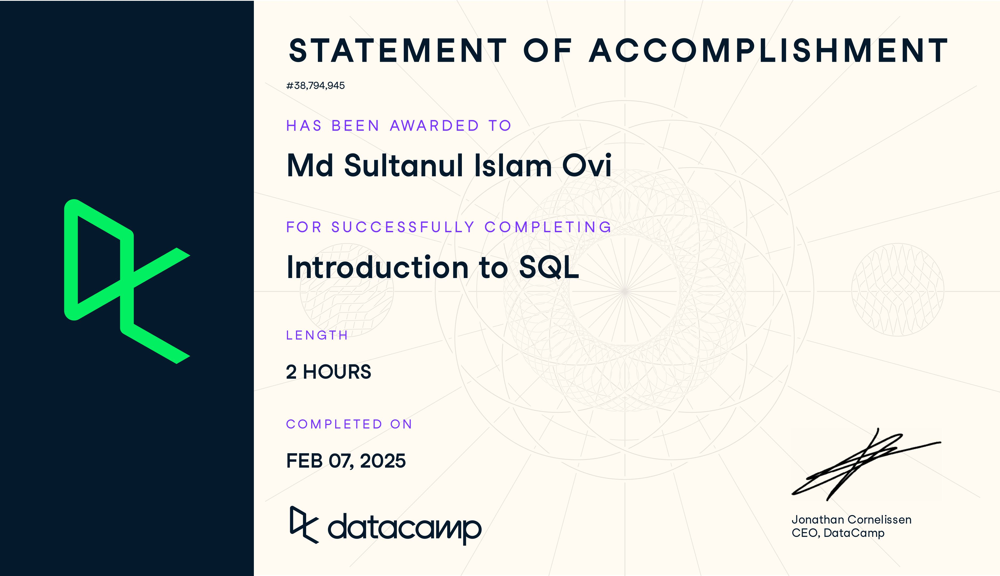

# Associate Data Analyst in SQL

---

## Course 01: Introduction to SQL

Learn how to create and query relational databases using SQL in just two hours.

## Course 02: Intermediate SQL (4 hours)

Level up your data science skills by creating visualizations using Matplotlib and manipulating DataFrames with pandas.

## Project 01: Analyzing Students' Mental Health

Use your data manipulation skills to perform exploratory data analysis on a dataset around student mental health.

## Project 02: Analyzing Motorcycle Part Sales

Derive insights about motorcycle part sales over time across multiple warehouse sites!
