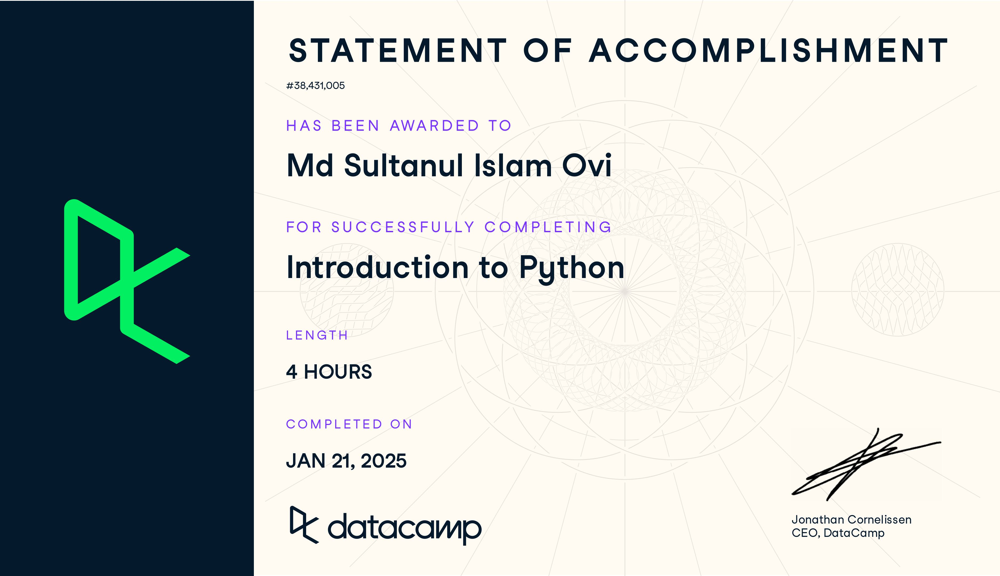

# Data Analyst in Python

---

## Course 01: Introduction to Python

Master the basics of data analysis with Python in just four hours. This online course will introduce the Python interface and explore popular packages.

## Course 02: Intermediate Python (4 hours)

Level up your data science skills by creating visualizations using Matplotlib and manipulating DataFrames with pandas.

## Project 01: Investigating Netflix Movies

Apply the foundational Python skills you learned in Introduction to Python and Intermediate Python by manipulating and visualizing movie data.

## Course 03: Data Manipulation with pandas (4 hours)

Learn how to import and clean data, calculate statistics, and create visualizations with pandas.

## Project 02: Exploring NYC Public School Test Result Scores

Use data manipulation and summary statistics to analyze test scores across New York City's public schools!

## Course 04: Joining Data with pandas (4 hours)

Learn to combine data from multiple tables by joining data together using pandas.

## Course 05: Introduction to Statistics in Python (4 hours)

Grow your statistical skills and learn how to collect, analyze, and draw accurate conclusions from data using Python.

## Course 06: Introduction to Data Visualization with Seaborn (4 hours)

Learn how to create informative and attractive visualizations in Python using the Seaborn library.

## Project 03: Visualizing the History of Nobel Prize Winners

Explore a dataset containing a century's worth of Nobel Laureates. Who won? Who got snubbed?

## Skill Assessment 01: Data Manipulation with Python

## Skill Assessment 02: Importing & Cleaning Data with Python

## Course 07: Exploratory Data Analysis in Python (4 hours)

Learn how to explore, visualize, and extract insights from data using exploratory data analysis (EDA) in Python.

## Project 04: Analyzing Crime in Los Angeles

Find out when and where crime is most likely to occur, along with the types of crimes commonly committed in LA.

## Course 08: Sampling in Python (4 hours)

Learn to draw conclusions from limited data using Python and statistics. This course covers everything from random sampling to stratified and cluster sampling.

## Course 09: Hypothesis Testing in Python (4 hours)

Learn how and when to use common hypothesis tests like t-tests, proportion tests, and chi-square tests in Python.

## Project 05: Hypothesis Testing with Men's and Women's Soccer Matches

Perform a hypothesis test to determine if more goals are scored in women's soccer matches than men's!

---

Feel free to explore the solutions and contribute to the repository. Thanks
